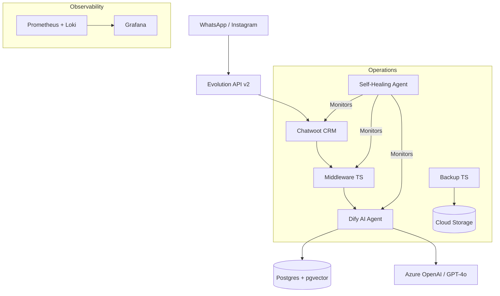

# NexaDuo Omnichannel AI Stack 🚀

A **production-grade, self-healing omnichannel support ecosystem**. This stack is designed as a high-performance laboratory and portfolio piece, showcasing the integration of leading Open Source tools with custom AI automation.

## 🌟 Key Features (The "Big Five")

1.  **Unified Omnichannel Hub**: Centralizes WhatsApp, Instagram, and Webchat via **Evolution API v2** and **Chatwoot**, providing a single pane of glass for human and AI agents.
2.  **Agentic Brain (RAG-Ready)**: Powered by **Dify**, featuring advanced RAG (Retrieval-Augmented Generation) with `pgvector`, MCP (Model Context Protocol) support, and native **Azure OpenAI** orchestration.
3.  **Autonomous Self-Healing**: A dedicated **Self-Healing Agent** (TypeScript) that monitors stack health and proactively resolves common infrastructure anomalies.
4.  **Full-Stack Observability**: Integrated **Prometheus, Grafana, Loki, and Promtail** (PLG Stack). Pre-provisioned dashboards track Dify latency, token usage by tenant, and system metrics.
5.  **DevOps Excellence (IaC & Automation)**:
    *   **Unified Compose**: 100% parity between local development and GCP production.
    *   **Automated Onboarding**: Playwright-based scripts for instant admin creation and smoke testing.
    *   **Safe-Ops**: Automated daily backups to **Google Cloud Storage (GCS)** and zero-downtime reconfiguration via **Coolify**.

## 🏗️ Architecture



## 🚀 Quickstart (Laboratory Mode)

### 1. Initialize Environment
```bash
cd onboarding
npm install
npm run generate-env    # Generates .env with robust secrets and alexandre@nexaduo.com admin
```

### 2. Full Cycle Validation (The "One Command" Test)
This command destroys any existing local stack, brings it up, waits for health, runs onboarding, and executes smoke tests:
```bash
npx tsx ../scripts/validate-stack.ts
```

### 3. Unified Access
Access all services with the same credentials:
*   **Email:** `alexandre@nexaduo.com`
*   **Password:** Defined in your `.env` (generated in Step 1)

| Service | Local URL | Production URL |
| :--- | :--- | :--- |
| **Coolify** | `http://localhost:8000` | `https://coolify.nexaduo.com` |
| **Chatwoot** | `http://localhost:3000` | `https://chat.nexaduo.com` |
| **Dify** | `http://localhost:3001` | `https://dify.nexaduo.com` |
| **Grafana** | `http://localhost:3002` | `https://grafana.nexaduo.com` |

## 🛠️ Stack Components

*   **Runtime:** Node.js 22 (Fastify), Ruby on Rails (Chatwoot), Python (Dify).
*   **Persistence:** Postgres 16 (pgvector), Redis 7 (Alpine).
*   **Infrastructure:** GCP (GCE), Cloudflare Tunnel, Terraform, Coolify.
*   **Testing:** Playwright (TypeScript) for E2E and Onboarding.

## 📈 Roadmap & Portfolio Notes

This repository serves as a live laboratory for:
*   [x] Multi-tenant database partitioning.
*   [x] Automated WebSocket routing via Cloudflare Tunnels.
*   [x] Seamless migration from Docker-local to Cloud SQL (Planned).
*   [x] Advanced RAG pipelines using MCP tools.

---
*Maintained by Alexandre @ NexaDuo — 2026*
