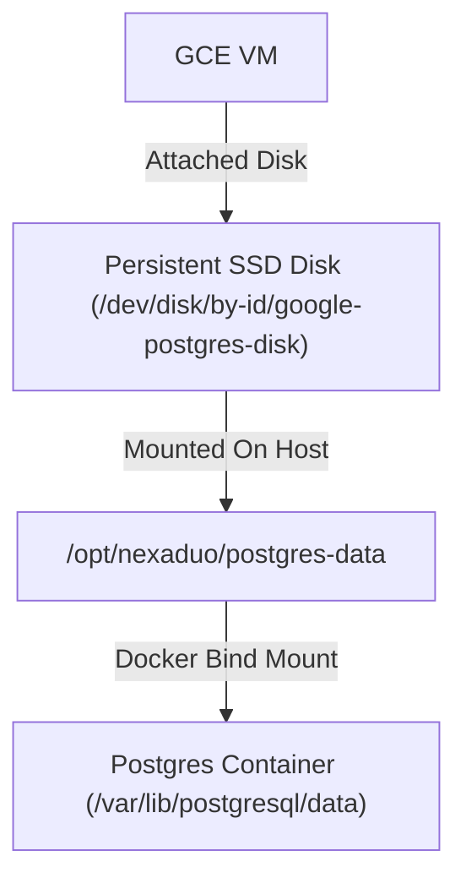
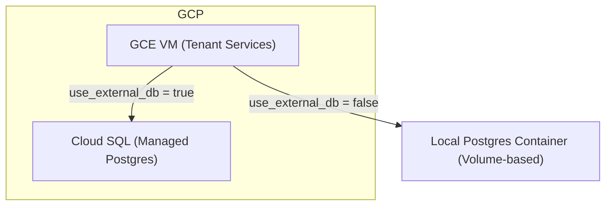

# Persistent Postgres Database Support Implementation Plan

> **For agentic workers:** REQUIRED SUB-SKILL: Use superpowers:subagent-driven-development (recommended) or superpowers:executing-plans to implement this plan task-by-task. Steps use checkbox (`- [ ]`) syntax for tracking.

**Goal:** Implement persistent PostgreSQL storage options in Terraform without disrupting existing tenant volume-based setups.

**Architecture:** Provides two options. Option 1 deploys a dedicated GCP Persistent SSD Disk, attaches it to GCE VM, and mounts it to `/opt/nexaduo/postgres-data` for local postgres container bind mounts. Option 2 introduces an optional GCP Cloud SQL managed Postgres instance activated via Terraform variable `use_external_db` with fallback to local volume database.

**Tech Stack:** Google Cloud Platform, Terraform (HCL), Docker Compose, PostgreSQL.

---

## Proposed Options

### Option 1: Persistent SSD GCP Disk (Recommended & Low-Cost)
We create a dedicated SSD persistent disk on GCP, attach it to GCE VM, and bind-mount it inside the postgres container on host.



### Option 2: Managed GCP Cloud SQL (Conditional)
We provision a Cloud SQL Postgres instance on GCP. An input variable `use_external_db` toggles routing of tenant databases.



---

## Tasks for Option 1: Persistent GCP Disk

### Task 1: Update GCP VM Module to Provision and Attach Disk

**Files:**
- Modify: `infrastructure/terraform/modules/gcp-vm/main.tf`

- [ ] **Step 1: Declare Persistent Disk and Attachment resources**

Add resources at bottom of file:
```hcl
resource "google_compute_disk" "postgres_disk" {
  name  = "${var.name}-postgres-disk"
  type  = "pd-ssd"
  zone  = var.zone
  size  = var.disk_size
  lifecycle {
    prevent_destroy = true
  }
}

resource "google_compute_attached_disk" "postgres_attached" {
  device_name = "postgres-disk"
  disk        = google_compute_disk.postgres_disk.id
  instance    = google_compute_instance.vm.id
}
```

- [ ] **Step 2: Commit VM module modifications**

Run:
```bash
git add infrastructure/terraform/modules/gcp-vm/main.tf
git commit -m "infra: provision and attach persistent postgres disk in VM module"
```

---

### Task 2: Configure Startup Script to Auto-Mount Persistent Disk

**Files:**
- Modify: `infrastructure/terraform/modules/gcp-vm/scripts/install-coolify.sh`

- [ ] **Step 1: Add disk formatting and mounting logic**

Append mounting script to setup script:
```bash
# Wait and mount persistent postgres disk if attached
DISK_ID="/dev/disk/by-id/google-postgres-disk"
MOUNT_PATH="/opt/nexaduo/postgres-data"

if [ -b "$DISK_ID" ]; then
  echo "Mounting persistent disk: $DISK_ID"
  
  # Format ext4 if partition is unformatted
  if ! blkid "$DISK_ID" > /dev/null 2>&1; then
    mkfs.ext4 -m 0 -E lazy_itable_init=0,lazy_journal_init=0,discard "$DISK_ID"
  fi
  
  # Create directory and mount
  mkdir -p "$MOUNT_PATH"
  mount -o discard,defaults "$DISK_ID" "$MOUNT_PATH"
  
  # Set permissions so postgres can write
  chown -R 999:999 "$MOUNT_PATH"
  chmod -R 775 "$MOUNT_PATH"
  
  # Persist mount across reboots
  if ! grep -q "$DISK_ID" /etc/fstab; then
    echo "$DISK_ID $MOUNT_PATH ext4 discard,defaults,nofail 0 2" >> /etc/fstab
  fi
fi
```

- [ ] **Step 2: Commit startup script modifications**

Run:
```bash
git add infrastructure/terraform/modules/gcp-vm/scripts/install-coolify.sh
git commit -m "infra: format and mount attached persistent disk on startup"
```

---

### Task 3: Update Production Docker Compose to Bind-Mount Persistent Disk

**Files:**
- Modify: `deploy/docker-compose.shared.yml`

- [ ] **Step 1: Update Postgres volumes section**

Map Postgres data to the newly mounted path:
```yaml
  postgres:
    image: pgvector/pgvector:pg16
    restart: unless-stopped
    environment:
      POSTGRES_USER: ${POSTGRES_USER:-postgres}
      POSTGRES_PASSWORD: ${POSTGRES_PASSWORD}
      POSTGRES_DB: postgres
      TZ: ${TZ:-UTC}
    volumes:
      - /opt/nexaduo/postgres-data:/var/lib/postgresql/data
      - /opt/nexaduo/postgres/01-init.sql:/docker-entrypoint-initdb.d/01-init.sql:ro
```

- [ ] **Step 2: Commit Docker Compose modifications**

Run:
```bash
git add deploy/docker-compose.shared.yml
git commit -m "deploy: update shared postgres service with bind-mounted persistent disk"
```

---

## Tasks for Option 2: Conditional Cloud SQL Support

### Task 4: Create Cloud SQL Terraform Module

**Files:**
- Create: `infrastructure/terraform/modules/gcp-cloud-sql/main.tf`

- [ ] **Step 1: Write Cloud SQL Terraform configuration**

Create file with database and private IP network attachment:
```hcl
variable "project_id" { type = string }
variable "region" { type = string }
variable "name" { type = string }
variable "vpc_id" { type = string }
variable "db_password" { type = string }

resource "google_compute_global_address" "private_ip_alloc" {
  name          = "${var.name}-private-ip-alloc"
  purpose       = "VPC_PEERING"
  address_type  = "INTERNAL"
  prefix_length = 16
  network       = var.vpc_id
}

resource "google_service_networking_connection" "private_vpc_connection" {
  network                 = var.vpc_id
  service                 = "servicenetworking.googleapis.com"
  reserved_peering_ranges = [google_compute_global_address.private_ip_alloc.name]
}

resource "google_sql_database_instance" "postgres" {
  name             = "${var.name}-db"
  database_version = "POSTGRES_16"
  region           = var.region

  depends_on = [google_service_networking_connection.private_vpc_connection]

  settings {
    tier = "db-custom-1-3840" # Small shared core
    ip_configuration {
      ipv4_enabled    = false
      private_network = var.vpc_id
    }
  }
}

resource "google_sql_user" "postgres" {
  name     = "postgres"
  instance = google_sql_database_instance.postgres.name
  password = var.db_password
}

output "private_ip" {
  value = google_sql_database_instance.postgres.private_ip_address
}
```

- [ ] **Step 2: Commit Cloud SQL module**

Run:
```bash
git add infrastructure/terraform/modules/gcp-cloud-sql/main.tf
git commit -m "infra: create cloud sql managed postgres module"
```

---

### Task 5: Integrate Cloud SQL conditionally in Production Environment

**Files:**
- Modify: `infrastructure/terraform/envs/production/foundation/main.tf`
- Modify: `infrastructure/terraform/envs/production/foundation/variables.tf`

- [ ] **Step 1: Add variable to control database execution**

Add variables inside `infrastructure/terraform/envs/production/foundation/variables.tf`:
```hcl
variable "use_external_db" {
  type    = bool
  default = false
}

variable "db_password" {
  type      = string
  sensitive = true
}
```

- [ ] **Step 2: Instantiate Cloud SQL module conditionally in main.tf**

Append at bottom of `infrastructure/terraform/envs/production/foundation/main.tf`:
```hcl
module "cloud_sql" {
  count  = var.use_external_db ? 1 : 0
  source = "../../../modules/gcp-cloud-sql"

  project_id  = var.gcp_project_id
  region      = var.gcp_region
  name        = var.app_name
  vpc_id      = module.vm.vpc_id
  db_password = var.db_password
}

output "db_host" {
  value = var.use_external_db ? module.cloud_sql[0].private_ip : "postgres"
}
```

- [ ] **Step 3: Commit integration**

Run:
```bash
git add infrastructure/terraform/envs/production/foundation/main.tf infrastructure/terraform/envs/production/foundation/variables.tf
git commit -m "infra: add conditional external cloud sql instance configuration"
```

---

## Verification Plan

### Automated Verification
- Run local sandbox testing:
```bash
./scripts/validate-stack.sh
```
- Expect: local stack deploys correctly with local DB container volumes.

### Manual Verification
1. Apply production foundation changes with Option 1:
```bash
./scripts/deploy-production.sh
```
2. Verify persistent GCP disk attachment on GCE host VM:
```bash
gcloud compute ssh ubuntu@nexaduo-chat-services --project=nexaduo-492818 --zone=us-central1-b --tunnel-through-iap --command "df -h | grep postgres-data"
```
3. Expect output: `/dev/sdb` mapped to `/opt/nexaduo/postgres-data`.
